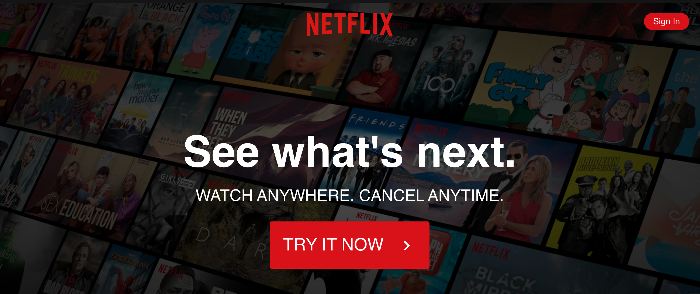

Netflix Clone

### `npm start`
Runs the app in the development mode. 
Open [http://localhost:3000](http://localhost:3000) to view it in the browser.

# Project Name 
Karleigh Ponnock Portfolio

  ## Overview 
 This is my current project.
In the video series listed in the credits below, we are building a clone of Netflix website. 
For navigation in our react app, we are using React Router library. To style the components we are using styled-components library.
 
  ## Table of Contents:
  - [Screenshots_and_GIFs](#Screenshots_and_GIFs)
  - [Installation](#Installation)
  - [Credits](#Credits)

 ## Screenshots_and_GIFs 
  -  
 

  
  ## Installation 
  - npm i 

 # Access the app here: 
Deployed: 

Github: https://github.com/karleighponnock/Clone_Netflix_Website

# Author
Karleigh Ponnock
Github: https://github.com/karleighponnock
LinkedIn: https://www.linkedin.com/in/karleigh-ponnock-3601421aa/

# Credits
80/20 Coding on Youtube 
Part 1: https://www.youtube.com/watch?feature=youtu.be&v=fs01JJIqfRk&app=desktop
Part 2: https://www.youtube.com/watch?v=9dI-COa33Kk&t=333s

